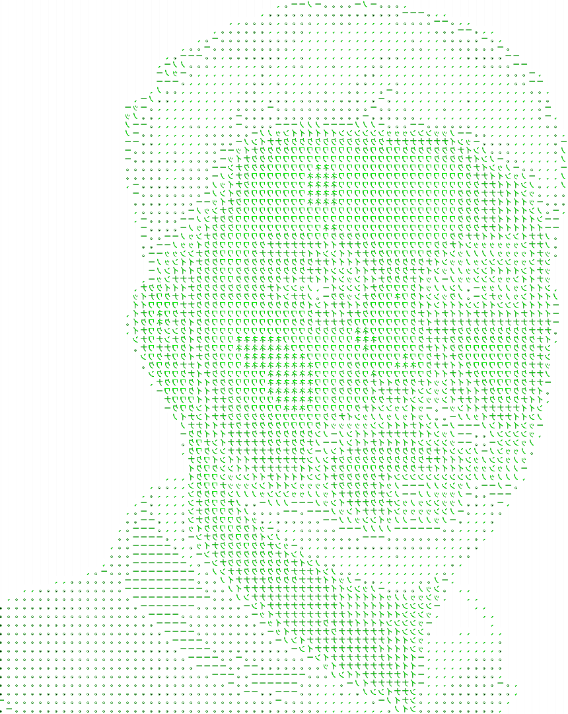

<div align="center" width="100%" height="100%" >

<h3>Hola, Iam Shibin <h3>
<h4>Software Developer from India | Computer Science Graduate<h4>
 
[](https://www.linkedin.com/in/mohdshibin/)
[](mailto:shibinvgl@gmail.com)


<hr>
</div>


<div>


```javascript

mohammedshibinv@github
-------------------------
Pronouns : He/Him
Location : India
Languages: Python, PHP, Javascript
Framework: Django, Laravel, React, Flutter

Handles:
-------
Portfolio : mohammedshibinv.web.app
Linkedn   : mohammedshibinv
Kaggle    : mohammedshibinv

                                 ▬▬▬.◙.▬▬▬
                                    ▂▄▄▓▄▄▂
                                 ◢◤ █▀▀████▄▄▄▄__◢◤
                                 █▄▂█ █▄███▀▀▀▀▀▀▀╬
                                  ◥█████◤
Lets Connect  =>                  ══╩══╩══
```
</div>


<!-- 
 <table align="center" width="100%" height="100%" >
   <tr>
     <td> 
  
 </td>
     <td> [](https://github.com/MohdShibin) </td>
   </tr>
  </table>

<hr>
<h3 align="center" > 🚀 Languages - Frameworks - Tools - Libraries - Workspace 🚀</h3>
<p align="center">
    
 --> 
